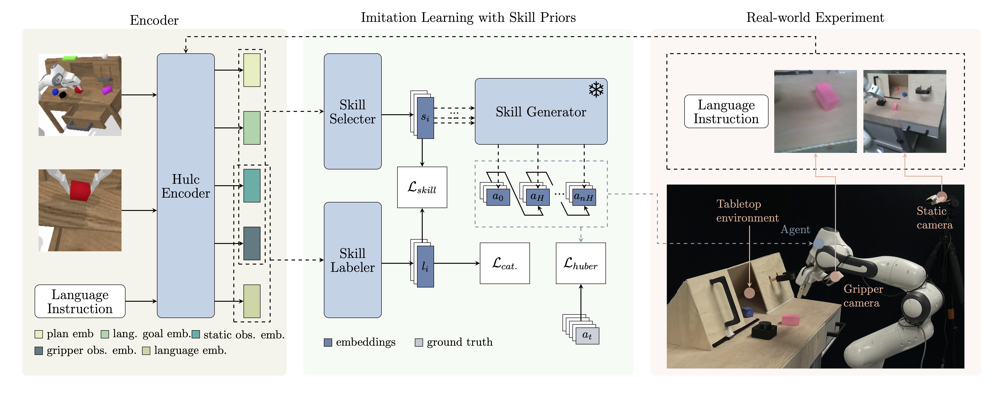

# spil_sim2real
## Introduction
This is our code base for sim2real experiments of our SPIL model. The experiment setting is similar to CALVIN benchmark which is illustrated in the right side of following figure.

## Requirements
* 1x Franka Emika Pandas Robot Arm
* 2x Realsense D435 Cameras
* Ubuntu 20.04.6 LTS (Focal Fossa)
* Tabletop Environment

## Setup
### Install libfranka and rt-kernel
* Following the [instructions](https://frankaemika.github.io/docs/libfranka.html) to install libfranka and rt-kernel on your ubuntu system
* Install Frankx according to [this](https://github.com/pantor/frankx)
  * example folders contains some codes to get familiar with frankx 

### Install requirements
create an virtual environment and install the required packages through
`pip install -r requirements.txt`

### Install SPIL and skill_generator modules
```
cd models/skill_generator
pip install -e .
cd ../SPIL
pip install -e .
```
### Getting serious number of camera
To get the serious number of your D435 cameras:
```
cd perception/utils
python3 connect_devices.py
```
change ids of DEVICE_NAME_LIST in perception/perception.py with those serious numbers

### trained policy 
The trained policy should be copied into SPIL and skill_generator modules' checkpoints folder

## Testing
To test your trained policy, please run `python3 agent.py`
